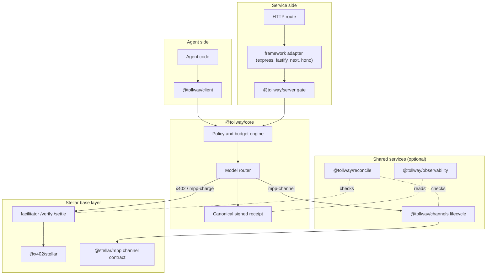
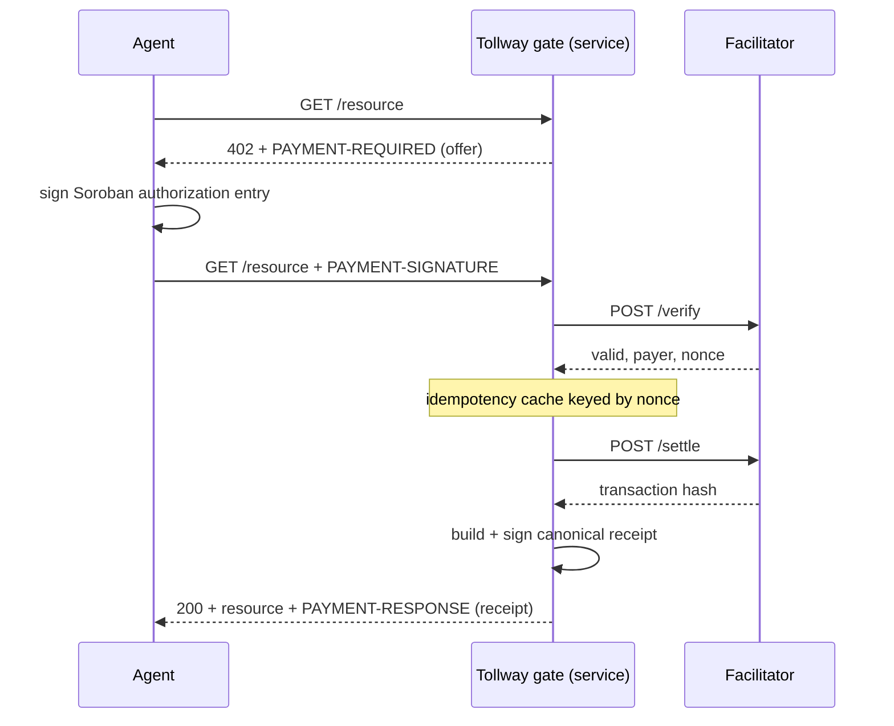

<p align="center">
  
</p>

<h1 align="center">Tollway</h1>

<p align="center">
  Orchestration, policy, and observability for agent payments on Stellar.
</p>

<p align="center">
  <a href="https://usetollway.vercel.app"><strong>Website</strong></a> ·
  <a href="https://usetollway.vercel.app/docs"><strong>Docs</strong></a>
</p>

<p align="center">
  <a href="https://github.com/vegaforge/tollway/actions/workflows/ci.yml"></a>
  <a href="LICENSE"></a>
</p>

---

## Why Tollway exists

Stellar ships two agent-payment primitives, and they are different tools with different settlement models and separate SDKs.

**x402** settles one payment per request. A client hits a route, gets a `402` carrying a `PAYMENT-REQUIRED` challenge, signs a Soroban authorization entry, resubmits it in a `PAYMENT-SIGNATURE` header, and a facilitator verifies and settles on chain before the server returns the resource. Funds go straight to the recipient; the facilitator is non-custodial.

**MPP** covers the other cost shapes. Its *charge* mode is per-request and on-chain, much like x402. Its *channel* mode is a different settlement model entirely: a one-way payment channel in a Soroban contract where the funder deposits once, then makes many off-chain payments by signing cumulative commitments, and a single on-chain transaction at close pays the recipient the cumulative total and returns the remainder.

Both primitives are good. The cost shows up the moment a service or an agent uses more than one of them. Someone has to choose the model per counterparty, run the channel lifecycle, enforce budgets across models, normalize three different settlement artifacts into one receipt, reconcile off-chain commitments against on-chain settlement, and provide observability over all of it. Every team rebuilds that layer, and it is real systems work.

Tollway is that layer, built once and shared. It sits **above** `@x402/stellar` and `@stellar/mpp` and composes them. It is not a facilitator, not a base SDK, and it never custodies funds.

## Architecture

Tollway is a library plus an optional shared service. Most users embed the library: a client wrapper on the agent side, payment-gate middleware on the service side. Teams that want shared budgets, reconciliation, and dashboards across many processes run the optional service.



### The model router

The router is the conceptual core. Per interaction or per counterparty it decides how a payment settles:

- **x402 per-request** is the default for unknown counterparties and the right answer when access is occasional and per-URL accountability matters.
- **MPP charge** applies when the service standardizes on MPP but traffic is still per-request.
- **MPP channel** kicks in when sustained high-frequency access to a single counterparty crosses a configurable threshold. The router opens a channel, routes later payments as off-chain commitments, and schedules the close.

Its inputs are declared offer hints, observed traffic shape, explicit configuration, and policy constraints. Every decision is overridable per route and per agent.

### The x402 request path

The implemented Phase 0 slice runs end to end through `@tollway/core`, `@tollway/server`, an adapter, and a facilitator:



A short-lived settlement cache keyed by the authorization nonce makes a duplicate submission idempotent rather than a second charge. In channel mode the cumulative-commitment design is naturally idempotent, since a repeated commitment at the same sequence is a no-op.

### The canonical receipt

Every settlement, on any model, produces one signed receipt. Downstream accounting, dispute evidence, and analytics consume a single shape instead of three.

| Field | Meaning |
| ----- | ------- |
| `payer`, `payee` | Stellar addresses on each side |
| `amount`, `asset` | integer string in the asset's smallest unit |
| `resource` | URL or stable identifier of what was bought |
| `model` | `x402`, `mpp-charge`, or `mpp-channel` |
| `settlement` | transaction hash (x402, charge) or channel id + commitment sequence (channel) |
| `network`, `issuedAt` | testnet or mainnet, and an ISO 8601 timestamp |
| `signature` | Ed25519 over the canonical bytes, with the signing `keyId` |

Receipts are signed through a swappable signer interface, so the key can live in process, in a KMS, or behind an HSM. Canonicalization sorts object keys at every level, so the same receipt body always produces the same bytes and the same signature.

## Packages

Tollway is a pnpm and Turborepo monorepo. Each package is independently buildable, so you can work on one without building the rest.

| Package | Responsibility |
| ------- | -------------- |
| `@tollway/core` | model router, policy schema, canonical receipt, shared types |
| `@tollway/client` | agent-side client wrapper |
| `@tollway/server` | service-side payment gate, framework agnostic |
| `@tollway/adapter-express` | Express adapter (the reference adapter) |
| `@tollway/adapter-fastify` | Fastify adapter |
| `@tollway/adapter-next` | Next.js App Router adapter |
| `@tollway/adapter-hono` | Hono adapter |
| `@tollway/channels` | MPP channel lifecycle manager |
| `@tollway/reconcile` | reconciliation engine |
| `@tollway/observability` | metrics, exports, webhooks |
| `@tollway/theme` | shared design tokens |

Apps: `apps/web` (landing page and docs), `apps/dashboard` (observability UI), `apps/demo` (end-to-end x402 demo).

## Quickstart

Requires Node 22+ and pnpm 10+.

```bash
git clone https://github.com/vegaforge/tollway.git
cd tollway
pnpm install
pnpm build
pnpm test
```

Run the x402 demo with no network, from challenge to a verified receipt:

```bash
MOCK_MODE=true pnpm --filter @tollway/demo start
```

Drop `MOCK_MODE` to run against a real testnet facilitator; set `FACILITATOR_URL` to override the default.

Gate a route on the service side:

```ts
import { Ed25519Signer } from "@tollway/core";
import { createPaywall, createMockFacilitator } from "@tollway/server";
import { expressPaywall } from "@tollway/adapter-express";

const signer = await Ed25519Signer.generate("service-key");
const gate = createPaywall(
  { amount: "10000", asset: "USDC:GA5Z...", payTo: "GSERVICE...", network: "testnet" },
  { signer, facilitator: createMockFacilitator() },
);

app.get("/quotes/latest", expressPaywall(gate), (_req, res) => {
  res.json({ symbol: "XLM/USD", price: "0.1234" });
});
```

## Status

Implemented and tested today:

- The canonical signed receipt: build, sign, and verify, with a swappable Ed25519 signer.
- The shared domain types and the model-router interface, with x402 routing.
- The x402 per-request path end to end, through the server gate, the Express adapter, and a facilitator, with an idempotency cache.

Defined as typed interfaces with tracked implementation work:

- MPP charge and MPP channel settlement.
- The channel lifecycle manager: open, commit, close, recover.
- The policy and budget engine, reconciliation, and anomaly stops.
- Observability collection, exports, and webhooks.
- The Fastify, Next.js, and Hono adapters (Express is the reference implementation).

Browse the [open issues](https://github.com/vegaforge/tollway/issues) for claimable work, especially the [good first issues](https://github.com/vegaforge/tollway/issues?q=is%3Aissue+is%3Aopen+label%3Adifficulty%3Agood-first-issue). The full design and the planned sequence of work are in [docs/design.md](docs/design.md).

## Security

Non-custodial throughout: x402 settles to the recipient, channel funds live in the channel contract, and Tollway never holds funds. Replay protection comes from the settlement cache and the idempotent cumulative-commitment design; reconciliation is the safety net against a counterparty that under-settles. Report vulnerabilities through [SECURITY.md](SECURITY.md), not public issues.

## Contributing

The monorepo is structured so you can own one package without learning the whole system. The framework adapters and the docs are the friendliest starting points; look for the `difficulty:good-first-issue` label. Start with [CONTRIBUTING.md](CONTRIBUTING.md).

## License

[Apache-2.0](LICENSE)
